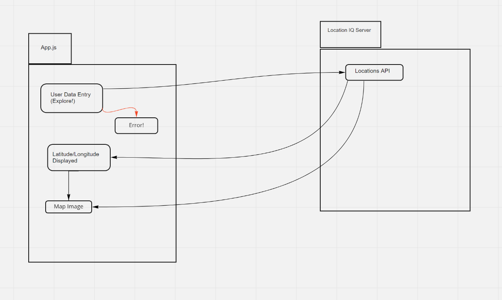

# Project Name

**Author**: Kellen Linse
**Version**: 1.2.0

## Overview
- This demo application utilizes React, Bootstrap, and Axios to access and display API data from locationIQ.com, weatherbit.io, and themoviedb.org
<!-- Provide a high level overview of what this application is and why you are building it, beyond the fact that it's an assignment for this class. (i.e. What's your problem domain?) -->

## Getting Started
- You will need create your own .env file and add your own API Key from locationIQ.com, weatherbit.io, and themoviedb.org, please see .sample.env for the format you will need to follow.
<!-- What are the steps that a user must take in order to build this app on their own machine and get it running? -->

## Architecture
- This application utilizes React, Bootstrap, and Axios.
<!-- Provide a detailed description of the application design. What technologies (languages, libraries, etc) you're using, and any other relevant design information. -->

## Change Log

V-1.1.0: 12/6/21  Application now has a fully-functional get requests, with error handling and basic styling.
V-1.2.0: 12/8/21 Application can now access and display API data from locationIQ.com, weatherbit.io, and themoviedb.org
V-1.3.0: 12/9/21 Refactor application and add styling.
<!-- Use this area to document the iterative changes made to your application as each feature is successfully implemented. Use time stamps. Here's an example:

01-01-2001 4:59pm - Application now has a fully-functional express server, with a GET route for the location resource. -->

## Credit and Collaborations
- Ryan Lee: Data Flow Diagram
<!-- Give credit (and a link) to other people or resources that helped you build this application. -->

## Time Estimate 1

Name of feature: Feature 1

Estimate of time needed to complete: 1.5hrs

Start time: 3:30

Finish time: 5:00

Actual time needed to complete: 1.5hrs

## Time Estimate 2

Name of feature: Feature 2 & 3

Estimate of time needed to complete: 2.5hrs

Start time: 5:15

Finish time: 8:15

Actual time needed to complete: 3hrs

--------

## Time Estimate 1

Name of feature: Feature 2

Estimate of time needed to complete: 2.5hrs

Start time: 5:00

Finish time: 8:30

Actual time needed to complete: 1.5hrs

